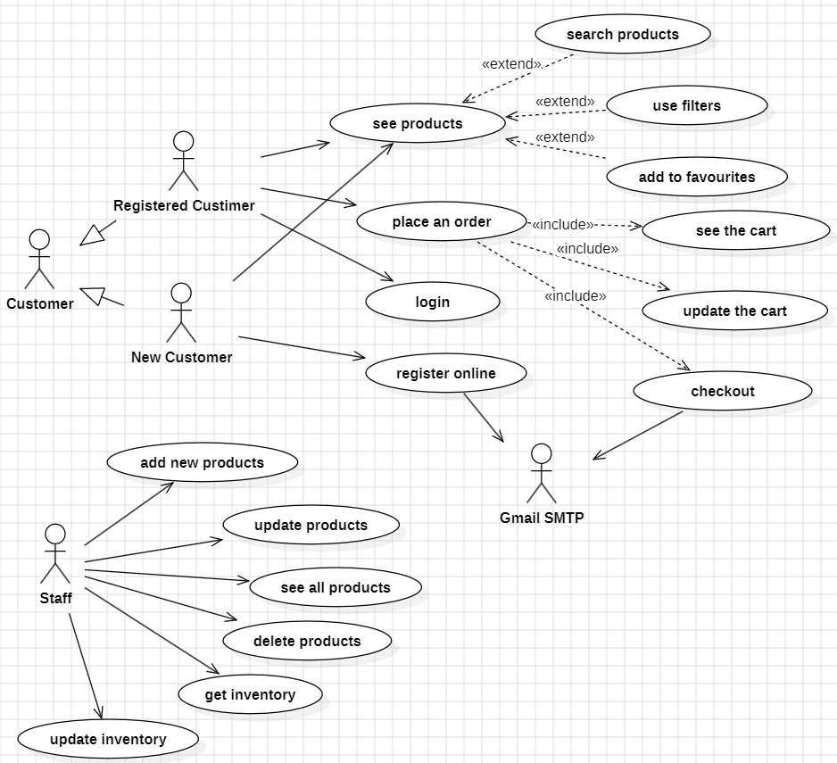

# Ecommerce Web Application

**backend deployment stopped** 
**Live demo version:** https://e-commerce-webapp-five.vercel.app/

## Table of Contents
- [Overview](#overview)
- [Features](#features)
  - [User Registration and Authentication](#user-registration-and-authentication)
  - [Product Management](#product-management)
  - [Shopping Cart](#shopping-cart)
  - [Order Management](#order-management)
  - [Inventory Management](#inventory-management)
  - [Category Management](#category-management)
  - [Security](#security)
  - [Email Notifications](#email-notifications)
- [Use-case Diagram](#use-case-diagram)
- [ER-diagram](#er-diagram)
- [Endpoints](#endpoints)
- [Technologies Used](#technologies-used)
- [Journaling using AOP](#journaling-using-aop)

## Overview
An e-commerce web application was developed. Users can register and login (data validation is implemented). A clear and user-friendly interface is offered. Functionality for adding products to the cart, removing, increasing and decreasing their quantity, cleaning the cart has been developed on the client side. Users can enter shipping data, and in case of successful validation, the user receives a confirmation letter with the contents of the order. On the server side, all the necessary endpoints for the web application to work correctly have been implemented (some endpoints do not require auth). A service for sending letters has been developed. A global error handler is provided. Logging for system audit has been introduced.

## Features
### User Registration and Authentication
Users can register online with step-by-step data validation and receive email for 2FA.
Authentication using JWT tokens.
### Product Management
Users can search for products using filters and add them to their carts. Staff can add new products, update existing ones, delete products, and manage inventory.

### Shopping Cart
Users can add products to the cart, update the quantity, remove items, and clear the cart.

### Order Management
Users can place orders and enter shipping information. Upon successful order placement, users receive a confirmation email with order details.

### Inventory Management
Staff can update inventory, ensuring the stock levels are maintained accurately.

### Category Management
Products are categorized for easy navigation and filtering.

### Security
Secure endpoints with JWT token validation. Role-based access control (RBAC) ensuring only authorized users can access specific functionalities.

### Email Notifications
Integration with Gmail SMTP for sending activation emails and order confirmations.

## Endpoints

### Authentication Endpoints

| Method | Endpoint | Description |
|--------|----------|-------------|
| POST   | /register | Registers a new user with the role `CUSTOMER`. Accepts registration details in the form of a `RegistrationBody` object, processes the registration through `AuthService`, and returns a `RegisterResponse`. |
| POST   | /login    | Authenticates a user using their credentials provided in a `LoginBody` object. Returns a `LoginResponse` containing authentication details. |
| GET    | /activate-account | Activates a user account using the provided activation token. Confirms the activation and returns a success message. |
| GET    | /me       | Retrieves details about the currently authenticated user. |
| PATCH  | /change-password | Allows the currently authenticated user to change their password. Accepts a `ChangePasswordBody` object with the new password details and processes the change through `AuthService`. Sends a confirmation email upon successful password change. |

### Staff Endpoints

| Method | Endpoint | Description |
|--------|----------|-------------|
| POST   | /staff/register | Registers a new staff member. Accepts staff registration details in a `RegistrationBody` object, assigns the role `STAFF`, processes the registration through `AuthService`, and returns a `RegisterResponse`. |
| POST   | /staff/product | Adds a new product. Accepts product details in a `ProductBody` object and processes the addition through `StaffService`. Accessible only to users with the `STAFF` role. |
| GET    | /staff/product/{id} | Retrieves a product by its ID. Returns product details and is accessible only to users with the `STAFF` role. |
| PUT    | /staff/product/{id} | Updates the details of an existing product identified by its ID. Accepts updated product details in a `ProductBody` object and processes the update through `StaffService`. Accessible only to users with the `STAFF` role. |
| DELETE | /staff/product/{id} | Deletes a product identified by its ID. Processes the deletion through `StaffService` and returns no content upon successful deletion. Accessible only to users with the `STAFF` role. |

### Product Endpoints

| Method | Endpoint | Description |
|--------|----------|-------------|
| GET    | /products | Retrieves a list of all products available in the system. This endpoint is accessible to any user. |

### Category Endpoints

| Method | Endpoint | Description |
|--------|----------|-------------|
| GET    | /categories | Retrieves a list of all categories available in the system. |

### Inventory Endpoints

| Method | Endpoint | Description |
|--------|----------|-------------|
| POST   | /inventory | Adds new inventory details for a product. |
| GET    | /inventory | Retrieves a list of all inventory items. |
| GET    | /inventory/{productId} | Retrieves inventory details for a specific product based on its ID. |
| PUT    | /inventory | Updates the quantity of multiple products in the inventory. |

### Address Endpoints

| Method | Endpoint | Description |
|--------|----------|-------------|
| GET    | /delivery | Retrieves a list of addresses associated with the authenticated user. Accessible to both customers and staff. |
| POST   | /delivery | Adds a new delivery address for the authenticated user. Accessible only to customers. |
| PUT    | /delivery/{addressId} | Updates an existing address identified by the address ID. Accessible only to customers. |
| DELETE | /delivery/{addressId} | Deletes an existing address identified by the address ID. Accessible only to customers. |

### Order Endpoints

| Method | Endpoint | Description |
|--------|----------|-------------|
| GET    | /order/all | Retrieves a list of all orders associated with the authenticated user. |
| GET    | /order/{orderId} | Retrieves details of a specific order identified by the order ID. |
| POST   | /order/{addressId} | Creates a new order for the authenticated user with order details and delivery address identified by the address ID. |
| DELETE | /order/{orderId} | Deletes an existing order identified by the order ID. |

## Technologies Used

* **Spring Boot 3**: For building the backend application.
* **React**: For building the responsive and dynamic client-side application.
* **Spring Security 6**: For implementing security features.
* **JWT Token**: For secure user authentication and session management.
* **PostgreSQL**: As the relational database for storing user, product, and order data.
* **Spring Data JPA**: For interacting with the PostgreSQL database.
* **OpenAPI (Swagger)**: For API documentation and testing.
* **Gmail SMTP**: For sending emails

## Use-case Diagram

## ER-diagram

## Journaling using AOP

